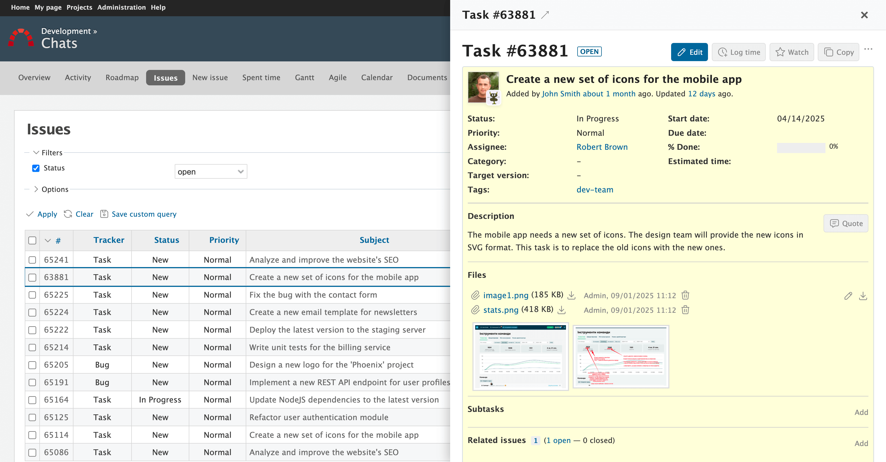
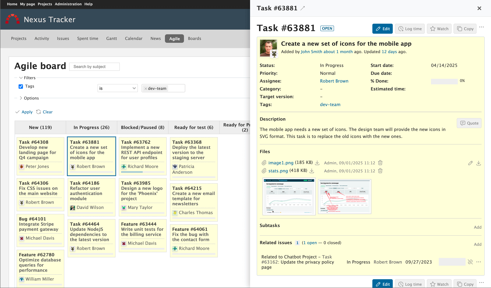

# Redmana - Chrome Extension

Redmine power features inspired by Asana: quick issue drawer, smarter board, and faster daily workflows.

## Features
Redmana brings the most time-saving Redmine enhancements straight into your browser:

- **Instant issue drawer** - open any issue in a lightweight side panel without leaving the board, update tasks inline, and keep the address bar in sync.
- **Media made easy** - tap thumbnails to view images in a lightbox and stay in context.
- **Agile board superpowers** – upgrade your RedmineUP Agile board with drag-and-drop column reordering, saved layouts, and smooth auto-scrolling while moving cards.
- **Sharper controls** - the assignee list remembers your latest collaborators for faster assignment.

Install the extension, open your Redmine instance, and Redmana activates automatically. No extra configuration steps required.
